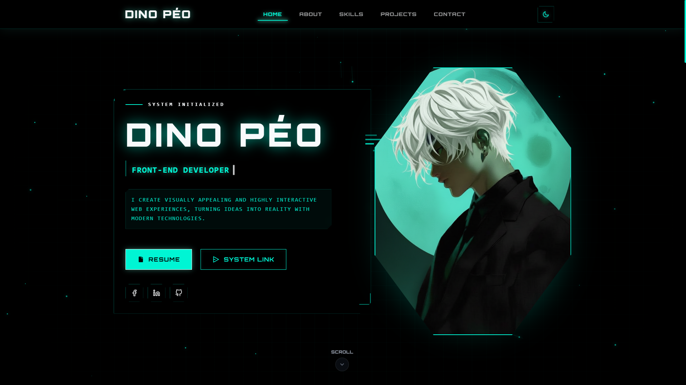

# 🌌 Dark Sci-Fi Portfolio - DINO PÉO

<div align="center">
  
</div>

<p align="center">
  <a href="https://react.dev/"></a>
  <a href="https://www.typescriptlang.org/"></a>
  <a href="https://vitejs.dev/"></a>
  <a href="https://tailwindcss.com/"></a>
  <a href="https://www.framer.com/motion/"></a>
  <a href="https://zustand-demo.pmnd.rs/"></a>
</p>

> A visually striking, high-performance personal portfolio website engineered with a premium **Dark Sci-Fi / Cyber** aesthetic. Designed to resemble an advanced Heads-Up Display (HUD) and futuristic data terminal, scaling perfectly with modern feature-driven architecture.

## ✨ Key Features & Aesthetic

- 🕶️ **Pure Black Dark Mode:** High-contrast OLED-ready `#000000` dark mode background for maximum depth.
- 🌌 **Cosmic Starry Sky:** Immersive animated starry background with nebula effects and shooting stars in dark mode.
- 📐 **HUD Terminal UI:** Geometric elements, glassmorphism headers, and modern tech accents.
- 🌍 **Internationalization (i18n):** Multi-language support built-in using `react-i18next`.
- 🌓 **Cyber Light Mode:** A fully supported contrasting bright tech theme with Deep Slate and Vibrant Teal (`#0D9488`).
- ⚡ **Maximum Performance:** Built on Vite + React 19, utilizing Framer Motion for buttery-smooth 60fps animations.
- 🏗️ **Feature-Driven Architecture:** Clean modular structure adopting Screaming Architecture principles for scalable frontend.

## 🛠️ Architecture & Tech Stack

- **Frontend Core:** React 19 (Function Components, Hooks)
- **Language:** TypeScript 5.8 (Strict Typing)
- **Build Tool:** Vite 6
- **Styling:** Tailwind CSS + PostCSS + CSS Variables for global theming
- **Animation Engine:** Framer Motion
- **State Pattern:** Zustand (Theme, Language, App State)
- **Routing:** React Router v7
- **UI Components & Icons:** Lucide React, React Icons, React Toastify

## 🚀 Quick Start

### Prerequisites

Ensure you have installed:

- [Node.js](https://nodejs.org/) (v18.0.0 or higher)
- npm, yarn, or bun.

### Installation & Run

1. Clone the repository:

```bash
git clone https://github.com/DuyPhatpeo/portfolio.git
cd portfolio
```

2. Install dependencies:

```bash
npm install
```

3. Initialize the Cyber Terminal (Start Dev Server):

```bash
npm run dev
```

4. Access the interface at `http://localhost:5173`.

## 📂 System File Hierarchy

```
portfolio/
├── public/                 # Static assets & OpenGraph Images
├── src/
│   ├── assets/             # Images, SVGs, global media
│   ├── components/         # Shared/Core UI Components (Buttons, Cards)
│   ├── constants/          # Static configuration and data
│   ├── features/           # Feature-driven modules (Hero, About, Project, etc.)
│   ├── hooks/              # Custom React Hooks
│   ├── i18n/               # Internationalization configurations
│   ├── layouts/            # Page layouts and structural components
│   ├── routes/             # App routing configuration
│   ├── stores/             # Zustand global state stores
│   ├── styles/             # Global CSS Architecture & Theme Tokens
│   ├── types/              # TypeScript global definitions
│   ├── App.tsx             # Root Application Assembly
│   └── main.tsx            # DOM Render Entry
├── index.html              # HTML Shell
└── vite.config.ts          # Vite Bundler Settings
```

## 🎨 Customizing the Terminal

The system is highly modular. To adapt the portfolio for your own identity:

1. **Identity Injection:** Edit the configuration models inside `src/constants/` (or update data files under `src/features/`).
2. **Language Configuration:** Add or modify translations inside `src/i18n/`.
3. **Theme Recalibration:** Modify the CSS Custom Properties found in `src/styles/` to change the core neon accent colors.

## 🚀 Deployment Protocol

### GitHub Actions (CI/CD)

The project includes a pre-configured GitHub workflow (`.github/workflows/node.js.yml`) that automatically lints and builds the project on every push to `main` and Pull Requests.

### GitHub Pages

1. Update `base` path in `vite.config.ts`:

```typescript
export default defineConfig({
  base: "/portfolio/", // Your repository name
  // ...
});
```

2. Execute build sequence:

```bash
npm run build
```

### Vercel / Netlify

The architecture is inherently serverless-ready. Link your GitHub repository to Vercel or Netlify, specify `npm run build` as the build command, and `dist` as the output directory. The system will deploy automatically upon commit.

## 👨‍💻 Operator

**DINO PÉO**

- GitHub: [@DuyPhatpeo](https://github.com/DuyPhatpeo)

---

<div align="center">
  <p>Engineered with 🩻 by DINO PÉO</p>
  <p>If this system architecture assists your development, initialize a ⭐ on the repository.</p>
</div>
